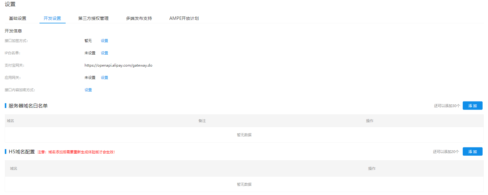
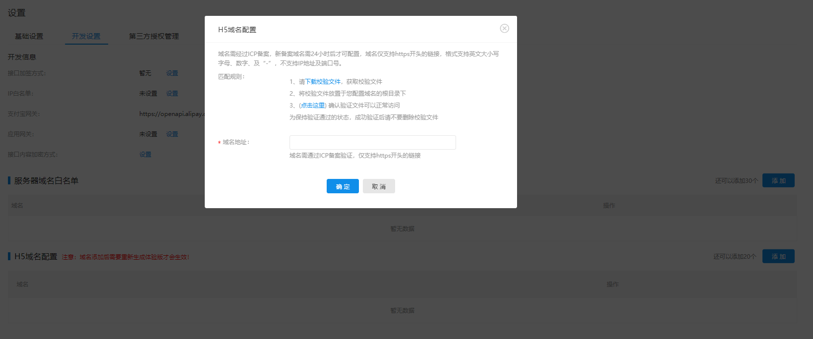

# 推啊小程序媒体对接

## 产品介绍


## 对接流程

1. 合作方媒体在推啊媒体平台 (https://ssp.tuia.cn) 注册账号
2. 创建广告位，在后台获取 appKey、adslotId 等参数
3. 在广告入口处进行小程序跳转


## 方案一：使用WebView组件打开推啊互动广告

### H5域名添加
推啊H5域名：

https://engine.aoclia.com

https://tui.yiyhua.cn

为保证WebView组件能够打开推啊域名，须添加小程序校验文件到推啊业务服务器，以及将推啊H5域名添加进小程序H5域名中。

* 登录 **支付宝开放平台** 进入小程序开发设置页面。



* 点击 H5 域名配置 中的 添加。



* 点击 **下载校验文件**，获取校验文件并放置在配置域名根目录下。

### 基础实现代码样例

* axml

```html
<view>
  <web-view src="{{src}}"><web-view>
<view>
```

* js

```js
Page({
  data() {
    return {
      src: ''
    }
  },
  onLoad() {
    const params = {
      appKey: '', // your appKey
      adslotId: '', // your adslotId
      device_id: '', // 用户设备ID Andriod:imei;iOS:idfa
      userId: '', // 用户唯一标识
    }
    function serialize(obj) {
      return Object.keys(obj)
        .map((key) =>
          obj[key] === null || obj[key] === undefined
            ? ''
            : key + '=' + obj[key]
        )
        .join('&');
    }
    this.setData({
      src: `https://engine.aoclia.com/index/activity?${serialize(params)}`
    })
  }
})
```

### 测试
对接完成后请体验整个广告流程（WebView 打开推啊活动 -> 参加活动 -> 点击各类券 -> 进入落地页），如反复检验后仍有问题请联系推啊开发

## 方案二：跳转推啊小程序

### 参数说明

* 推啊小程序的appId 为
  ```
  2019102868708522
  ```
* 跳转时需要带的参数

  | 参数名称 | 参数定义 | 是否必传 |
  |:----|:-----:|:----:|
  | adslotId| 广告位id（从推啊媒体平台获取）| 是 |
  | appKey | 媒体的Key(从推啊媒体平台获取）| 是 |
  | userId | 当前用户在媒体系统的唯一标识符（不能含特殊字符如```<,%```） | 是（生活号暂时不用传） |
  | miniAppId | 小程序的标识符 | 是小程序跳转，建议传。非小程序可以不传 |
  | device_id | 当前用户设备号，Andriod: imei, Ios: idfa(不能含特殊字符如```<,%```） | 保留字段，非必传 |
  | debug | 当debug参数存在，推啊小程序会自动跳转到调试页面，媒体可以用来检验参数（推荐传入```debug:true```） | 开发时确定参数 |

> 注意：

> appKey 或 adslotId 键名传错，或者不传，会进入到小程序的体验广告位。(debug下除外）

> appKey 或 adslotId 值传错，进入空白页面。 （debug下除外）

### 小程序跳转

* 小程序跳转方法

  ```js
  my.navigateToMiniProgram({
      appId: '2019102868708522',
      path: 'pages/index/index'
      extraData:{
        "appKey": "your appKey",   // 必传
        "adslotId": "your adslotId", // 必传
        "userId": "用户唯一标识符号",  // 非必传
        "device_id": "用户设备 ID，Andriod：imei；iOS：idfa", // 非必传
        "miniAppId": " 小程序的唯一Id " // 非必传
      },
      success: (res) => {
        console.log(res)
      },
      fail: (res) => {
        console.log(res)
      }
    });
  ```
  具体用法可以参见 [my.navigateToMiniProgram](https://docs.alipay.com/mini/api/yz6gnx)


### h5 或 其他APP 跳转

> 注意， h5 或 其他APP跳转推啊小程序时需要支持 URL Scheme。同时这里传入的参数，相当于推啊小程序/pages/index/index的*页面参数* 详见 https://opendocs.alipay.com/mini/api/xqvxl4

* 以h5为例

  ```js
  function toTuiaMini() {
    let appKey = '2ZWJpMz5ZHnjaGSmi7xx9YdZnRE3'
    let adslotId = '317704'
    let appId = '2019102868708522'
    let userId = 'xxxx'
    let base = `alipays://platformapi/startapp?appId=${appId}&page=pages/index/index`
    const eURICode = (obj) => {
      let params = '?'
      for (let i in obj) {
        params += i + '=' + obj[i] + '&'
      }
      return encodeURIComponent(params)
    }
    location.href = base + eURICode({appKey, adslotId, userId});
  }
  ```
其他APP 也同样,跳转时跳转完整参数

### 生活号跳转

下面以生活号广告位为例子。

1. 创建广告位 跳转类型 选择跳转小程序，如果没有关联小程序需要先[关联推啊小程序](https://fuwu.alipay.com/platform/miniProgram.htm)
跳转类型选择*跳转网页*（注意：不要选择小程序）

2. 网页链接拼接
  ```js
  function toTuiaMini() {
    let params = {
      appKey: '12312321',
      adslotId: '123123',
      debug: 'true'
    }
    let appId = '2019102868708522'
    let base = `alipays://platformapi/startapp?appId=${appId}&page=pages/index/index`
    const eURICode = (obj) => {
      let params = '?'
      for (let i in obj) {
        params += i + '=' + obj[i] + '&'
      }
      return encodeURIComponent(params)
    }
    return base + eURICode(params);
  };

  console.log(toTuiaMini());
```
将函数执行结果，复制到链接中，*注意修改params中的参数值*

其他位置跳转，流程也相似。

### debug

开发时，为保证媒体可以检验到传的参数是否正确，```appKey,adslotId``` 是否被推啊小程序接收到，可以加入参数```debug:true```，推啊小程序会跳到一个参数页面，媒体可以查看传入小程序的参数是否一致。

  

## 修订记录

| 编号 | 内容 | 修订时间 | 影响范围 |
| :--- | :---: | :---: | :--: |
| 1 | 测试版 | 2019-11-13 | - |
|2 | 生活号跳转内容修改 | 2019-12-12 | — |
|3 | WebView组件打开推啊互动广告 | 2020-06-29 | — |
